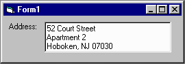



## PostalAddress Control

### Description

Data entry control for U.S. postal addresses in a single text box with automatic parsing and assembly.

If your application has to allow users to enter and view snail-mail U.S. postal addresses, your usual choices are separate text boxes for the parts of the address or one big text box for the whole thing. Usually, which it is depends on how you store it. This control gives your users the ease of having a single text box and your program the power to pick out the two street address lines, city, state, zip code, and 4-digit zip code extension as separate parts.

Does format validation, state abbreviation validation, state name conversion to abbreviations, data parsing and assembly to and from the same plain-text representation seen by users. Provides simple explanations for why a given address is invalid, if so. Also provides many of the most commonly-used properties and events of a typical text box.

As easy to use in your project as an ordinary text box. Extensive documentation provided in the code. Also includes an extensive HTML help file and demo project.

Recent Updates:

 5/18/2000: Added .Populate() method

 5/22/2000: Vastly improved parser to accommodate odd an incomplete addresses and added public array of error codes / messages.

Please vote for this code if you like it.
 
### More Info
 

             |
---                |---
**Submitted On**   |2000-05-22 12:45:14
**By**             |[James Vincent Carnicelli](https://github.com/Planet-Source-Code/PSCIndex/blob/master/ByAuthor/james-vincent-carnicelli.md)
**Level**          |Intermediate
**User Rating**    |4.4 (31 globes from 7 users)
**Compatibility**  |VB 4\.0 \(16\-bit\), VB 4\.0 \(32\-bit\), VB 5\.0, VB 6\.0, VB Script, ASP \(Active Server Pages\) 
**Category**       |[Custom Controls/ Forms/  Menus](https://github.com/Planet-Source-Code/PSCIndex/blob/master/ByCategory/custom-controls-forms-menus__1-4.md)
**World**          |[Visual Basic](https://github.com/Planet-Source-Code/PSCIndex/blob/master/ByWorld/visual-basic.md)
**Archive File**   |[CODE\_UPLOAD59975222000\.zip](https://github.com/Planet-Source-Code/james-vincent-carnicelli-postaladdress-control__1-8153/archive/master.zip)

